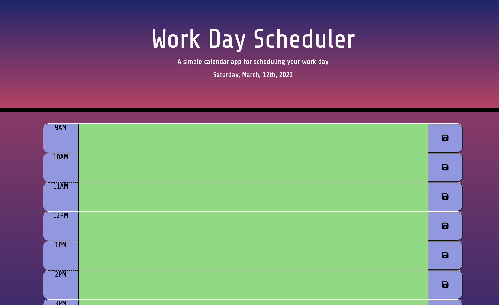

# Work-Day-Schedule

## Front End Project utilizing HTML, CSS, JS and 3rd party APIs, jQuery, Bootstrap and MomentJs.

The following application is a workday schedule using typical business day hours. It is a user interactive application that allows the user to input their daily tasks for each hour of the business day.

The application utilizes Moment.js to display the current date at the top of the application to easily allow the user to schedule their day. A unique feature of this schedule is that the individual task areas for each hour are dynamic and change color depending on the time of day. If the hour is in the future, the text area element will remain green, notifying the user that the task is not due at this hour. If the text area turns red, the user is notified that the deadline hour of this event is present. If the text area is grey, then that hour has passed. The colors of each hour can be applied in two ways. Either the user can refresh the page and have the function run again to apply the appropriate colors to each text area, or the built-in timer will refresh the page every hour automatically. This will ensure that the user is consistently being given the appropriate text area colors.

The user can add text for each hour’s text area. When they click the save button to right of each text area, the tasks typed by the user are saved into local storage. When the user refreshes the page, or the site does it automatically, the tasks will persist in their appropriate hour's text area.

The following is a live link to the Work Day Schedule application: https://charanvir.github.io/Work-Day-Scheduler/

Below is a screenshot of the deployed application:
- 
